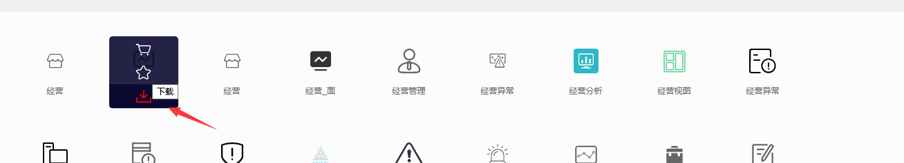
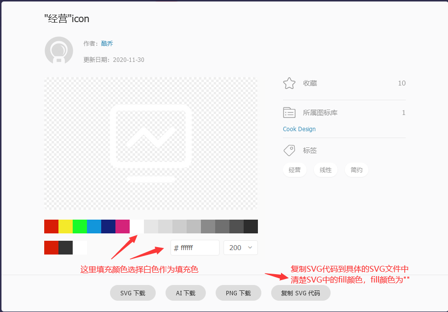

# Menu 菜单管理

## 新增一个菜单

- 导航栏菜单的新增一般都是新增到主页面的导航栏上，所以需要修改的是`BasicRouter`的文件内容。

### 新增一级菜单

#### 编写路由引入的页面文件
- 如果没有页面文件，路由会抛出错误。
- 路由的页面代码书写(**基本版**)
- 在`src/pages`创建页面文件，例如: `src/pages/business/picture`。
- 在页面文件中创建`index.tsx`和`index.less`文件，例如: `src/pages/business/picture/index.tsx`和`src/pages/business/picture/index.less`文件。

- **基本版**--`index.tsx`

```javascript
/**
 * @name Picture --- 对应页面组件的名称
 * @description 类组件以及函数组件都可以室友基本版
*/
import React, { PureComponent } from 'react';

import { GridContent } from '@ant-design/pro-layout';

import style from './index.less';


class Picture extends PureComponent<{}> {
  constructor(props) {
    super(props)
  }

  render() {
    return (
      <GridContent>
        <div>Picture</div>
      </GridContent>
    )
  }
}

export default Picture;
```

- **基本版**--`index.less`

```less
@import '~antd/es/style/themes/default.less';
```

------

#### 编写路由文件
- **第一步**, 首先在BasicRouter/modules新增一个菜单路由文件`路由名.ts`，例如: `business.ts`对应经营图。在文件中增加路由代码：

```typescript
/**
 * @name Business || 经营图
 * @description React.lazy 函数能让你像渲染常规组件一样处理动态引入（的组件）。React.lazy 和 Suspense 技术还不支持服务端渲染。
 * @description children为二级路由的数组
 * @param name 路由名称---供权限管理使用
 * @param title 路由标题---供菜单使用
 * @param icon 路由图标---供菜单使用
 * @param path 路由路径
 * @param children 子路由信息 也就是二级导航的内容，如果只是引入一级导航的话，没有children字段，而是直接接component内容，可以参照`dashboard.ts`进行配置
 * @param exact exact属性为true时路径中的hash值必须和path完全一致才渲染对应的组件，如果为false则'/'也可以匹配'/xxx';（如果strict属性为false，则末尾是否包含反斜杠结尾不影响匹配结果）
 * @param strict 这里没有使用。strict属性主要就是匹配反斜杠，规定是否匹配末尾包含反斜杠的路径，如果strict为true，则如果path中不包含反斜杠结尾，则他也不能匹配包含反斜杠结尾的路径，这个需要和exact结合使用
*/
import { lazy } from 'react';
import CommonRoute from '../CommonRoute';

const BusinessPlan = lazy(
  () => import(/* webpackChunkName: "business-plan" */ '@/pages/business/plan')
)

const BusinessPicture = lazy(
  () => import(/* webpackChunkName: "business-picture" */ '@/pages/business/picture')
)

const route: CommonRoute = {
  name: 'business',
  title: '经营图',
  icon: 'business',
  path: '/business',
  children: [
    {
      name: 'picture',
      title: '经营图视',
      path: '/business/picture',
      exact: true,
      component: BusinessPicture
    },
    {
      name: 'plan',
      title: '方案制作',
      path: '/business/plan',
      exact: true,
      component: BusinessPlan
    }
  ]
}

export default route;
```

- **第二步**, 如果没有icon的，引入你的Icon，如果有则直接进入**第三步**。
- 首先在[iconfont](https://www.iconfont.cn/)选择需要的icon，然后点击下载并选择填充色和修改icon代码，如下图所示:






- 然后在`src/components/Base/SvgIcon/index.tsx`引入icon文件和配置icon文件，例如:

```javascript
/**
 * @description 引入icon文件
 * @param ICON_NAME_MAP icon的匹配map文件参数，配置对应关系
 * @param iconNames icon的名称，配置icon的tupleStr信息
*/
import Business from '@/assets/icons/business.svg';

const ICON_NAME_MAP = {
  business: Business
}

const iconNames = tupleStr(
  'business'
)
```

- **第三步**，需要在`src/router/BasicRouter/InitRoute.ts`引入配置好的路由文件，如下:

```javascript
/**
 * @description 引入路由文件
 * @param routeMap 路由的Map文件，数组中增加引入的路由文件
*/
import businessRoute from './modules/business';
const routeMap = [businessRoute];
```

#### 重新运行项目未开启热加载

```shell
# ctrl + c/z之后重新运行项目
npm run start
# 或者
yarn start
```

------

> Thinking in JackDan
